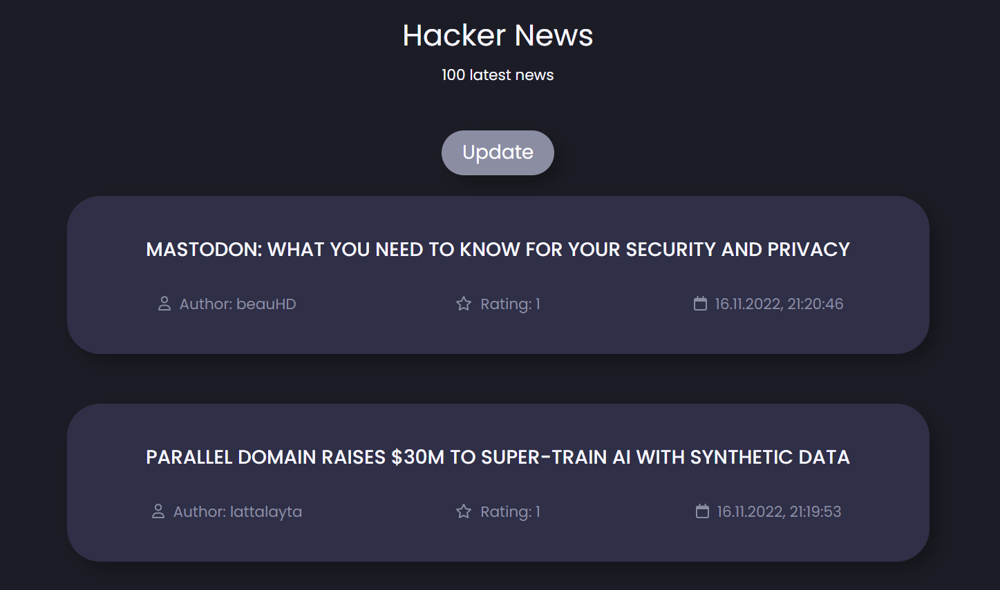

<h1 align="center">Hacker News App</h1>

## What is this web application for? 🚀

This application provides latest 100 news from Hacker News.

All the data come from the Hacker API: https://github.com/HackerNews/API

## Features 💡

- See latest 100 stories
- Update latest 100 stories
- Select a story for futher information
- Read all the comments under a story

## Technologies ⚒

- Javascript ES6
- React
- React Router
- React Helmet
- BEM
- CSS5
- SASS
- HTML5

## Setting up development environment 📍

- `git clone https://github.com/varflam/hacker-news.git`
- `yarn install`
- `yarn start`
- App should now be running on `http://localhost:3000/`
